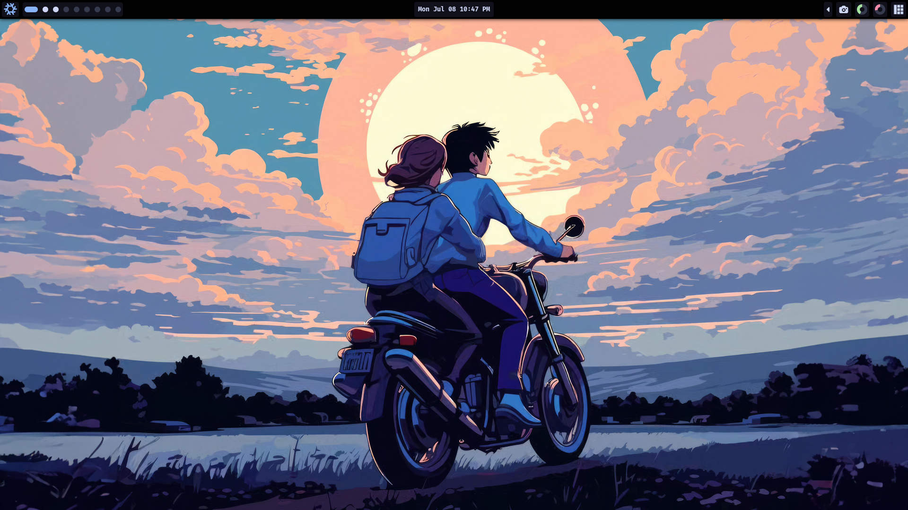

<h1 align="center">
 
   
   NixOS & Home Manager
</h1>

---

### Programs:

- $OS: [NixOS](https://nixos.org/)
- $WM: [Awesomewm](https://awesomewm.org/)
- $EDITOR: [Neovim](https://neovim.io/)
- $TERMINAL: [Wezterm](https://wezfurlong.org/wezterm/index.html)
- $BROWSER: [Qutebrowser](https://qutebrowser.org/)
